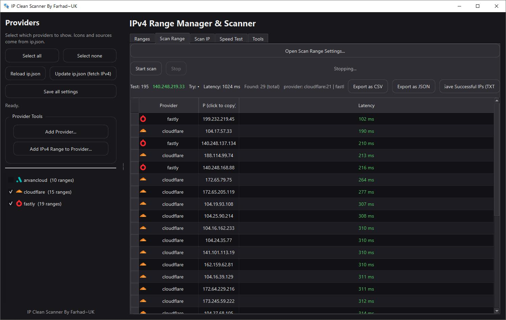

# IPCleanScanner 🚀

IPCleanScanner is a **Fastly clean IP scanner and tester** for your **v2rayN** configurations. It helps you find usable clean IPs and then **test them directly against your own config** so you can quickly pick the best working options.

## ✨ Features
- ⚡ Fast scanning for **clean Fastly IPs**
- 🧪 **Test scanned IPs** directly on your **own config** (Xray‑based)
- 📄 Load **JSON export** from v2rayN
- 🎯 Focused on **Cloudflare / Fastly** workflows
- 🧩 Simple, direct, and practical workflow
- ✅ **Range scanning** by provider CIDR (Sequential / Random / Shuffle unique)
- 🎛️ **Max latency filter**, regex filter, and max‑found limit
- 🧭 **Auto‑switch ranges** by time, % scanned, or first success
- 🧾 **Export results** as JSON or CSV
- 🗂️ **Save successful IPs** (all or per‑provider)
- 🧪 **Speed test** with Ping / Download / Upload / Both
- 🌍 Shows **Server IP + Country** after proxy is ready
- 🧠 **Auto provider detection** from `config/ip.json` CIDR ranges
- 🧰 Tools: **CIDR → IP list**, IP → Config generator
- 💾 **Save/restore app settings** between sessions
- 📋 One‑click **copy IPs** from result tables

## ✅ What This App Does
- Scans and detects clean Fastly IPs
- Lets you **test those IPs on your own config** to validate real‑world performance

## 📦 How To Export Your Config From v2rayN
1. Open **v2rayN**
2. Right‑click your **Cloudflare** or **Fastly** config
3. Click **Export > Export selected for complete configuration**
4. Save the **JSON** file
5. Load that JSON file inside IPCleanScanner

## 🧭 Typical Workflow
1. Export your config from v2rayN (JSON)
2. Load it into IPCleanScanner
3. Scan for clean Fastly IPs
4. Test the scanned IPs on your config
5. Pick the best results

## 🧩 Main Tabs (Quick Overview)
- **Ranges**: Choose providers, manage CIDR ranges, update `config/ip.json`
- **Scan Range**: Scan CIDR ranges with filters and auto‑switch logic
- **Scan IP**: Test a list of IPs, export results, save success lists
- **Speed Test**: Xray‑based tests (Ping / Download / Upload / Both)
- **Tools**: CIDR expansion, move IPs between tabs, IP → Config generator

## 🖥️ Requirements
- Windows
- v2rayN (for exporting configs)

## 📁 Files
- `config/ip.json` holds the provider CIDR ranges and icons
- `config/app_settings.json` stores saved UI settings

## 📣 Notes
- Make sure you export **complete configuration** from v2rayN as described above
- You can update provider IP ranges directly from their source URLs
- Tested for **Fastly clean IP scanning** use cases

---

Made with focus on speed and practical results. ✅
